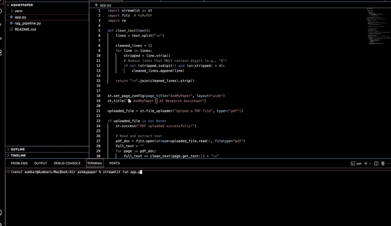

# 📄 AskMyPaper – AI-Powered Research Assistant (Offline)

**AskMyPaper** is a local, privacy-first research paper assistant that lets you upload a PDF and ask natural language questions like:  
➡️ “What is the main contribution?”  
➡️ “Summarize section 3.1”  

Built entirely using local models — no API keys or internet needed.

---

## 🚀 Features

- 📄 Upload academic PDF papers
- 🧩 Splits and embeds content into semantic chunks
- 🔍 Retrieves top-k relevant chunks using FAISS
- 🧠 Generates answers using **Mistral (7B)** via **Ollama**
- 🧪 Fully offline & fast — built with Streamlit

---

## 📸 Demo




---

## ⚙️ How It Works

1. PDF is cleaned and text is extracted using PyMuPDF
2. Text is split into overlapping chunks
3. `multi-qa-MiniLM-L6-cos-v1` from `sentence-transformers` generates semantic embeddings
4. FAISS indexes the chunks for retrieval
5. You ask a question — top-k chunks are retrieved
6. Answer is generated by Mistral (local) via Ollama

---

## 🧪 Tech Stack

| Component        | Tool/Library                     |
|------------------|----------------------------------|
| LLM              | [Mistral via Ollama](https://ollama.com)
| Embeddings       | `sentence-transformers` (MiniLM)
| Vector Search    | FAISS
| PDF Parsing      | PyMuPDF
| UI Framework     | Streamlit
| OS Tested        | macOS (M4)

---

## 🛠️ Local Setup

```bash
# Clone the repository
git clone https://github.com/Aumkarsd/askmypaper.git
cd askmypaper

# Create virtual environment
python3 -m venv venv
source venv/bin/activate

# Install Python dependencies
pip install -r requirements.txt

# Start Ollama server in background (first run downloads model)
ollama run mistral

# Run the Streamlit app
streamlit run app.py

```

## 💡 Example Prompts

- Who are the contributors of this paper?
- What are the results mentioned?
- Summarize the abstract in simple terms.
- What is the main contribution of section 2?
- What model or dataset did they use?


## 📌 Future Enhancements (Planned)

- [ ] Gemini or OpenAI fallback option
- [ ] Section-aware chunking
- [ ] PDF export of Q&A
- [ ] Follow-up/fine-tuned Q&A interface


## 👤 Author

Built by **[Aumkar Devdhar](https://github.com/Aumkarsd)**  
Graduate from IIT Roorkee   
Passionate about AI, LLMs, and practical ML apps
